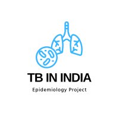

# National TB Report Summary - Chapter 3A
> **Brief Description:** - Chapter 3A of the "India TB Report 2023" focuses on the diagnostic services provided under the National Tuberculosis Elimination Programme (NTEP). The chapter outlines the various diagnostic tools and strategies employed to improve TB detection and ensure accurate and timely diagnosis, which is critical for effective treatment and control of the disease.
> 

---

## Table of Contents

- [Summary](#summary)
- [Program Codes ](#program-codes)
- [Plots](#plots)
- [Contribution](#contributipn)
- [Contact Details](#contact-details)

---

##Summary
**Chapter 3A of the "India TB Report 2023" focuses on the diagnostic services provided under the National Tuberculosis Elimination Programme (NTEP). The chapter outlines the various diagnostic tools and strategies employed to improve TB detection and ensure accurate and timely diagnosis, which is critical for effective treatment and control of the disease.**

### Key Highlights:

#### Microscopy Services:
Microscopy remains the backbone of TB diagnosis in India. The NTEP has decentralized microscopy services to ensure accessibility across the country.
Quality assurance of microscopy is maintained through External Quality Assessment (EQA) mechanisms.

#### Nucleic Acid Amplification Tests (NAAT):
The program has significantly expanded the use of NAAT, such as Truenat and CBNAAT, to provide rapid and accurate diagnosis.
In 2022, over 1.5 million NAAT tests were conducted, with an increase in the number of diagnostic sites equipped with these technologies.

#### Culture and Drug Susceptibility Testing (DST):
Liquid culture systems and Line Probe Assay (LPA) are used for DST, crucial for detecting drug-resistant TB (DR-TB).
The number of culture and DST laboratories has been increased to enhance the detection of DR-TB cases.

#### X-Ray and Imaging Services:
Digital X-ray machines have been deployed, and portable X-ray units are used in remote and hard-to-reach areas.
AI-based tools are being piloted to improve the accuracy of X-ray interpretation.

#### Innovations and New Initiatives:
Introduction of Whole Genome Sequencing (WGS) for TB surveillance and research.
Use of AI-enabled handheld X-ray machines for community screening in vulnerable populations, leading to early detection and treatment initiation.

#### Training and Capacity Building:
Regular training programs for laboratory technicians and healthcare providers on the use of new diagnostic tools and protocols.
Emphasis on hands-on training and refresher courses to maintain high standards of diagnostic services.

#### Data Management and Reporting:
Integration of diagnostic data with the Ni-kshay system for real-time monitoring and reporting.
Efforts to ensure data quality and accuracy through regular audits and validations.

## Program-codes

The programs are written on jupiter notebook, You may run the program on Google colab by clicking on the colab badge below. However, the output may not be generated on colab. For that you have to download the program and run it locally. Make sure that the packages are all installed.

## Plots

### Observations from the Plot:
#### DMC (Designated Microscopy Centers):
There has been a consistent increase in the number of DMCs from 2018 to 2022, reaching a peak of 23,038 in 2022.

#### CBNAAT (Cartridge Based Nucleic Acid Amplification Test):
The number of CBNAAT sites has shown a gradual increase from 651 in 2017 to 1,475 in 2022, indicating steady expansion.

#### Truenat:
Truenat was introduced in 2019, and its deployment has grown significantly, from 367 sites in 2019 to 3,615 sites in 2022, demonstrating rapid adoption.

#### NAAT (Nucleic Acid Amplification Test):
NAAT sites have also seen substantial growth, starting from 651 in 2017 and increasing to 5,090 in 2022, reflecting a strong emphasis on molecular diagnostic technologies in recent years.

Overall, the plot highlights a significant expansion in diagnostic technologies under the NTEP, with notable increases in the availability of both traditional microscopy centers and advanced molecular diagnostic tools.

## Contribution

The reports and programs are written by Santanu Karmakar

## Contact-details

If you wish to contact me, please leave a message (Preferably WhatsApp) on this number: 6291 894 897.
Please also mention why you are contacting me. Include your name and necessary details.
Thank you for taking an interest.
